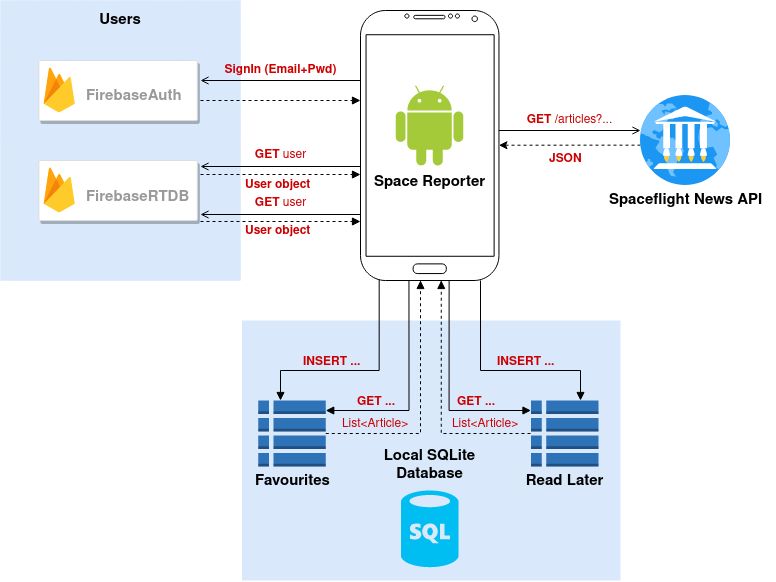

# Space-Reporter
Android application develop for the subject "Desarrollo de Aplicaciones Móviles", which is part of the Master in Informatics Engineering in the Universidad Politécnica de Madrid.

## Architecture / Services

This application uses [Firebase Auth](https://firebase.google.com/docs/auth/) and [Firebase RT Database](https://firebase.google.com/docs/database/) to manage users, [Spaceglight News API](https://thespacedevs.com/snapi) to access space related articles, and a local SQLite database to store user's favourites and read later articles.

## Features

- **Login**, **SignUp** and **Forgot password** (through account email)

- **Account verification** (through email)

- **Dynamic list** (RecyclerView) of articles about the space sector published on the [Spaceglight News API](https://thespacedevs.com/snapi).

- **Local SQLite database** with two tables, *Favourites* and *Read Later*, to store articles the user either wants to save or read later.

- Add to **Favourites** or **Read Later** and **Share** articles dircetly from the news dynamic list.

- **Direct access** to article on the web they have been published in.