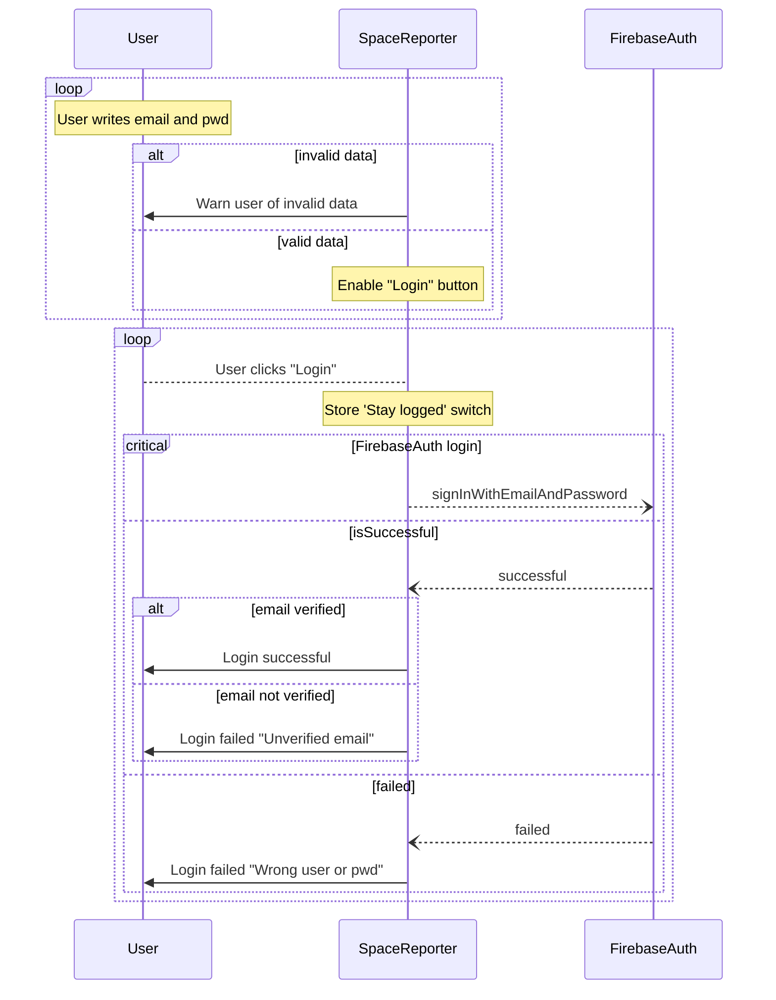
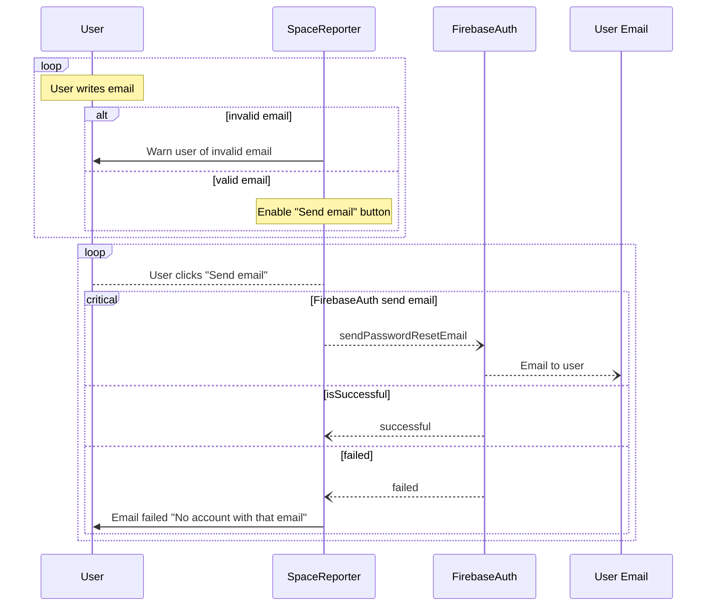
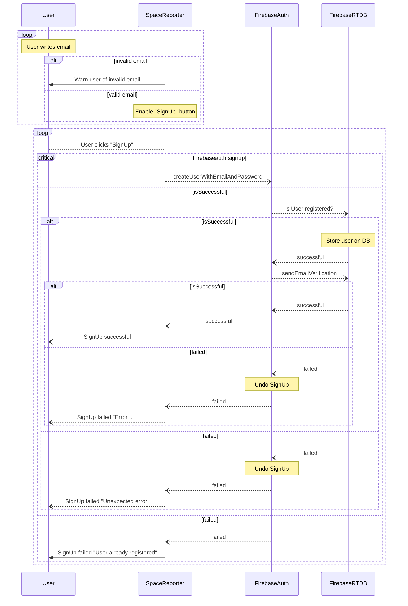

# Login process (Login)

```mermaid
sequenceDiagram
    participant us as User
    participant sr as SpaceReporter
    participant fb as FirebaseAuth
    loop
        Note over us: User writes email and pwd
        alt invalid data
            sr->>us: Warn user of invalid data
        else valid data
            Note over sr: Enable "Login" button
        end
    end
    loop
        us-->sr: User clicks "Login"
        Note over sr: Store 'Stay logged' switch
        critical FirebaseAuth login
            sr--)fb: signInWithEmailAndPassword
            option isSuccessful
                fb--)sr: successful
                alt email verified
                    sr->>us: Login successful
                else email not verified
                    sr->>us: Login failed "Unverified email"
                end
            option failed
                fb--)sr: failed
                sr->>us: Login failed "Wrong user or pwd"
        end
    end
```
# Change password (ForgotPwd)

```mermaid
sequenceDiagram
    participant us as User
    participant sr as SpaceReporter
    participant fb as FirebaseAuth
    participant em as User Email
    loop 
        Note over us: User writes email
        alt invalid email
            sr->>us: Warn user of invalid email
        else valid email
            Note over sr: Enable "Send email" button
        end
    end
    loop
        us-->sr: User clicks "Send email"
        critical FirebaseAuth send email
            sr--)fb: sendPasswordResetEmail
            fb--)em: Email to user
            option isSuccessful
                fb--)sr: successful
            option failed
                fb--)sr: failed
                sr->>us: Email failed "No account with that email"
        end
    end
```
# SignUp

```mermaid
sequenceDiagram
    participant us as User
    participant sr as SpaceReporter
    participant fba as FirebaseAuth
    participant fbdb as FirebaseRTDB
    loop 
        Note over us: User writes email
        alt invalid email
            sr->>us: Warn user of invalid email
        else valid email
            Note over sr: Enable "SignUp" button
        end
    end
    loop
        us-->sr: User clicks "SignUp"
        critical Firebaseauth signup
            sr--)fba: createUserWithEmailAndPassword
            option isSuccessful
                fba--)fbdb: is User registered?
                alt isSuccessful
                    Note over fbdb: Store user on DB
                    fbdb--)fba: successful
                    fba--)fbdb: sendEmailVerification
                    alt isSuccessful
                        fbdb--)fba: successful
                        fba--)sr: successful
                        sr--)us: SignUp successful                        
                    else failed
                        fbdb--)fba: failed
                        Note over fba: Undo SignUp
                        fba--)sr: failed
                        sr--)us: SignUp failed "Error ... "
                    end
                else failed
                    fbdb--)fba: failed
                    Note over fba: Undo SignUp
                    fba--)sr: failed
                    sr--)us: SignUp failed "Unexpected error"
                end
            option failed
                fba--)sr: failed
                sr->>us: SignUp failed "User already registered"
        end
    end
```
# Forgot password
```mermaid
sequenceDiagram
    
```